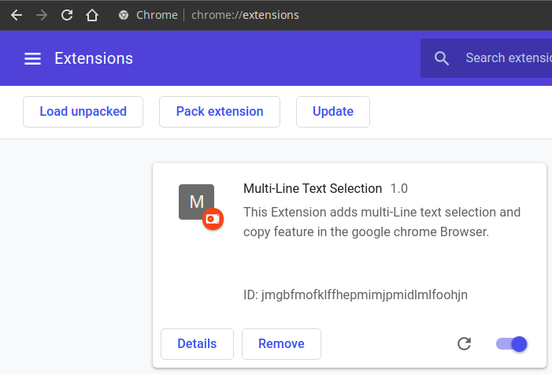
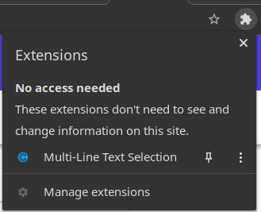

# Multi-Line Selection

## Introduction

This project aims to provide an extra functionality in google chrome web browser which allows a user to select multiple lines of text at the same time and user can copy the text.

## Installation

Clone the repo:

```
git clone https://github.com/mayank992/Multi-Line-Text-Selection.git
```

## Load into Chrome

To load the built files into Chrome, open [chrome://extensions/](chrome://extensions/).

Enable "Developer mode" if it's not enabled yet:


Click on "Load unpacked":


Find the Cloned directory on your system and open it.



The extension should be now at the top right of the chrome browser in the extensions:



## Usage

Selecting Text:

1. Press and Hold Ctrl key.
2. Select the text using the cursor.

Click anywhere on the webpage to remove the selected text.

Copying Text: Use Ctrl + C to copy the text.

Note: For now Right Click and copy is not working but I am working it and try to add it as soon as possible.

## External resources

- [MDN Web Docs](https://developer.mozilla.org/en-US/docs/Web)

- [Chrome Developer Documentation](https://developer.chrome.com/docs/extensions/mv2/devguide/)
